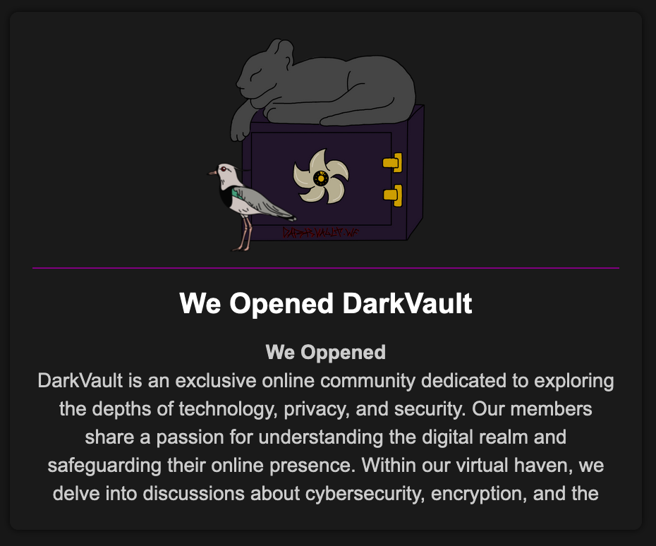

# (Español) Entrevista con el grupo de ransomware Dark Vault

# Acerca de Dark Vault

  

DarkVault es un grupo cibercriminal emergente conocido por sus sofisticados ataques dirigidos a diversas organizaciones en todo el mundo, incluyendo Latinoamérica. Aunque relativamente nuevo en la escena, DarkVault ha ganado notoriedad por su profesionalismo, métodos innovadores y su distintiva estética de sitio web, similar a la del grupo Lockbit (incluso llegando a ser confundido con un “rebranding”). Al mando están *criminaldo* y *Neroces*, quienes nos concedieron la presente entrevista.

# Charla con Dark Vault

Mi interlocutor es _velvet_, representante de Dark Vault.

**- ¿Cómo nació DarkVault? ¿Qué los llevó a la escena del ransomware?**

_Todos empezamos en la escena del ransomware hace más de 10 años. Solo recientemente DarkVault se convirtió en nuestra marca._

**- ¿Cuáles son sus motivaciones? ¿Solo financieras, o hay algo más?**

_Queremos dinero, no nos importan la política u otros temas._

**- ¿Qué es lo más especial de DarkVault? ¿Cuál es su momento/objetivo/logro del que más se enorgullecen hasta ahora?**

_Lo más especial es nuestra seguridad operativa (opsec) y nuestro logro más orgulloso es el pago de 10 millones de dólares de una empresa farmacéutica._

**- ¿Qué le depara el futuro a DarkVault? ¿Planean expandir operaciones u ofrecer un programa de afiliados?**

_Siempre estamos buscando nuevas técnicas porque tenemos mucha competencia. Todavía no tenemos un programa de afiliados._

**- ¿Hay algo que les gustaría decirle al resto de la escena, al público en general o a futuras víctimas?**

_Si los hackeamos, pagar el rescate es la mejor opción. Esto es solo un negocio para nosotros._

**- Por curiosidad, ¿por qué usan la estética del sitio web de Lockbit? ¿Su equipo trabajó con ellos en el pasado?**

_Trabajamos con miembros de Lockbit en el pasado, pero no somos Lockbit._

**- Contame un secreto, cualquier cosa que quieras. No tiene que estar relacionado con la seguridad o con DarkVault.**

_Cuando era chico tuve leucemia, pero sobreviví._
  

# Comentario final

DarkVault ha consolidado su presencia como un actor prominente en el ámbito del cibercrimen. Abarcando varias industrias (incluyendo el sector de la salud), han asegurado pagos significativos, como los 10 millones de dólares obtenidos de una empresa farmacéutica.

Su incursión en Argentina subraya su expansión estratégica a nivel global, y parece ser apenas el comienzo.

- [Mauro Eldritch](https://twitter.com/MauroEldritch)

---

# (English) Interview with Dark Vault ransomware group

# About Dark Vault

  

DarkVault is an emerging cybercriminal group known for its sophisticated attacks targeting various organizations worldwide, including Latin America. Although relatively new to the scene, DarkVault has gained prominence for its professionalism, innovative methods, and distinctive website aesthetics, similar to that of the Lockbit group (even being mistaken for a "rebranding"). Leading the group are *criminaldo* and *Neroces*, who granted us this interview.

# Conversation with DarkVault

I'm talking with _velvet_, representative of DarkVault.

**- How was Dark Vault born? What brought you to the ransom scene?**

*We all start in ransom scene over 10 years ago only now recent DarkVault our brand*

**- What are your motivations? Financial only, or is there something else?**

*We want money we not care politics or some others issues*

**- What is the most special thing about DarkVault? What’s your most proud moment/target/achievement so far?**

*Most special thing opsec and most proud achievement 10kk payment from pharmaceutical company*

**- What’s in the future for Dark Vault? Do you plan on expanding operations or offering an affiliate program?**

*We looking new technique always because we have many competition. we not have affiliate program yet*

**- Anything you would like to say to the rest of the scene, general public or future victims?**

*If we are hack you paying ransom is best choice and this only business for us*

**- Out of curiosity, why do you use Lockbit’s website aesthetics? Did your team work with them in the past?**

*We work with lockbit members in past but we not lockbit*

**- Tell me a secret, anything you like. Doesn't have to be related to security or Dark Vault at all.**

*When I was child I have leukemia but I survive it*

# Final thoughts

DarkVault has consolidated its presence as a prominent player in the cybercrime sphere. Spanning various industries (including the healthcare sector), they have secured significant payments, such as the $10 million obtained from a pharmaceutical company.

Their foray into Argentina underscores their strategic global expansion, and it appears to be just the beginning.

- [Mauro Eldritch](https://twitter.com/MauroEldritch)